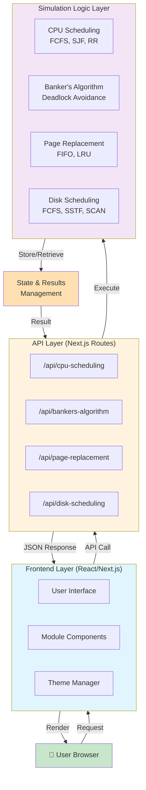
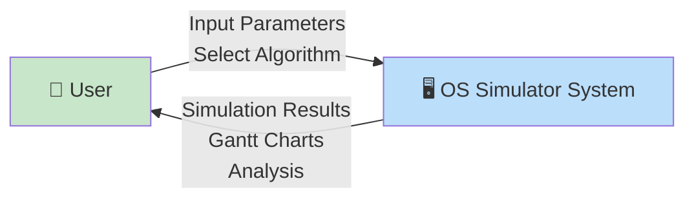
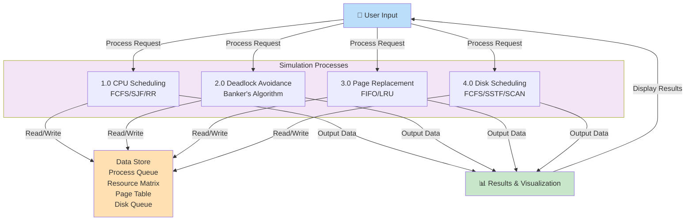
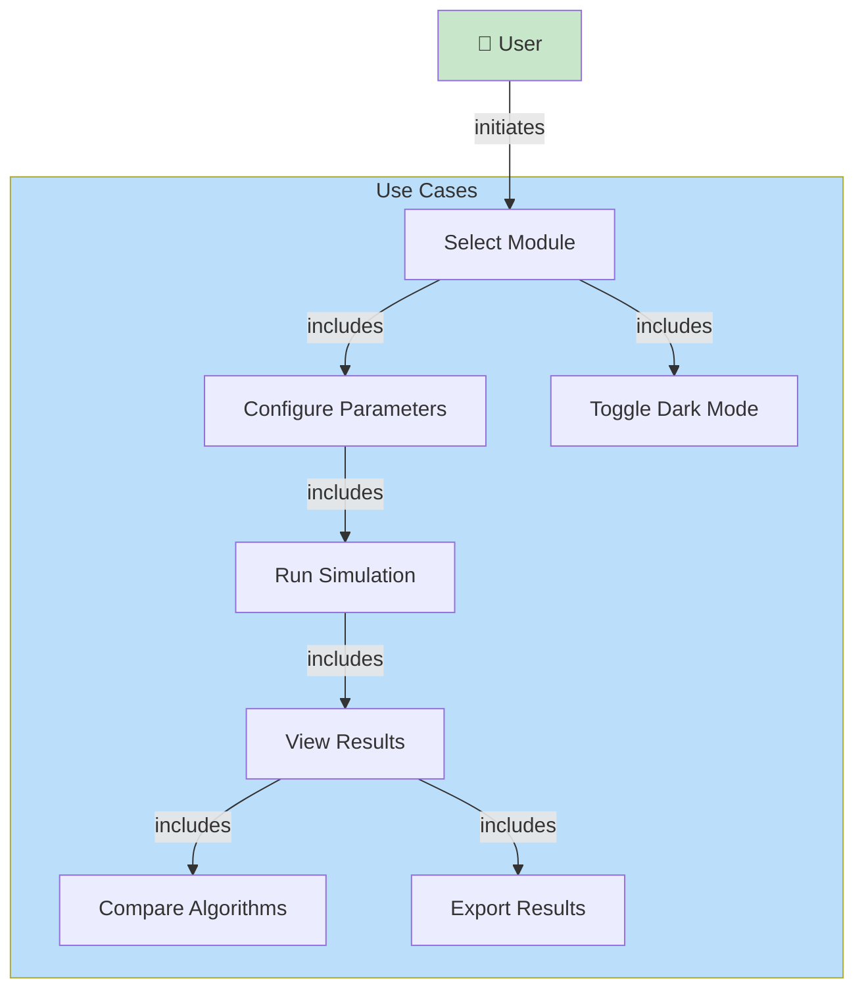
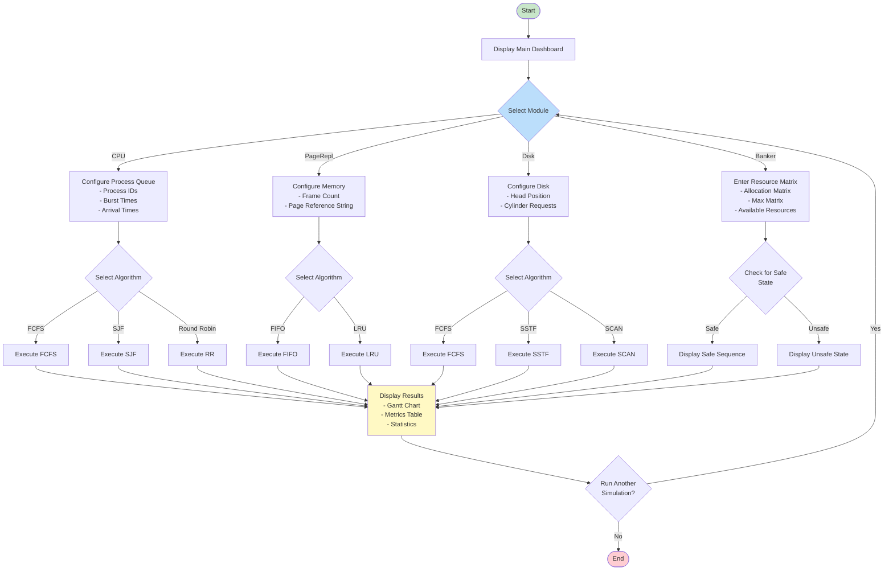
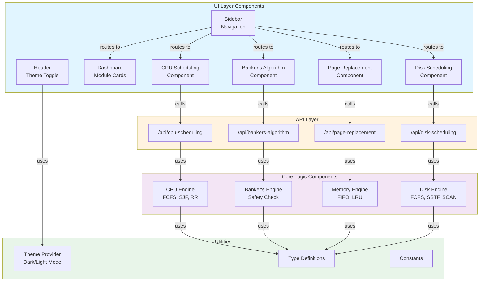
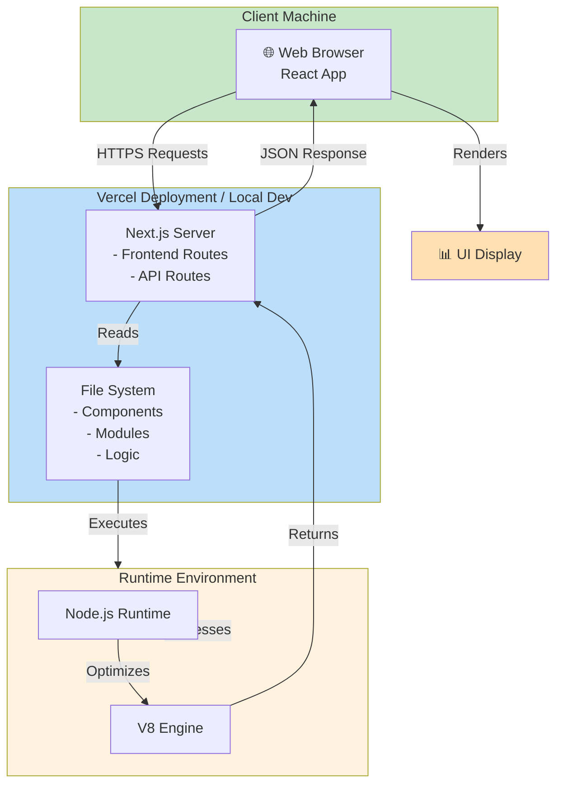
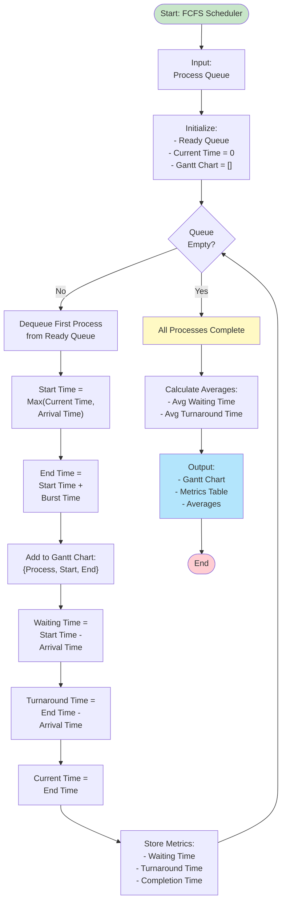
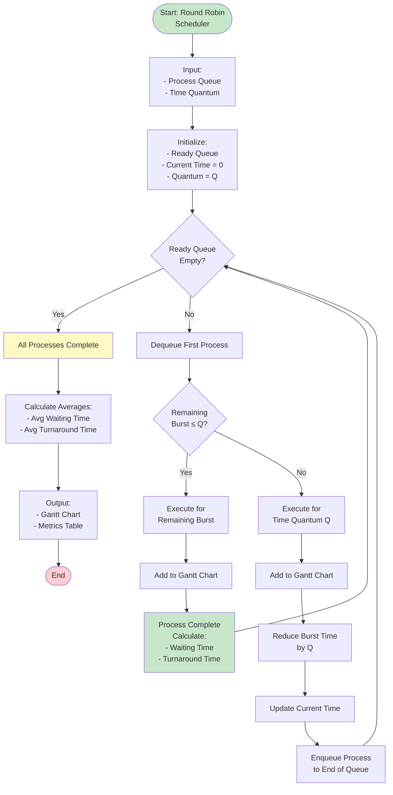

# All-in-One Operating System Simulator - System Design Diagrams

## 1. System Architecture Diagram



---

## 2. Data Flow Diagram (DFD)

### Level 0 - Context Diagram



### Level 1 - Process Decomposition



---

## 3. Use Case Diagram



---

## 4. Process Flowchart



---

## 5. Sequence Diagram

```mermaid
sequenceDiagram
    actor User
    participant Browser as React Frontend
    participant API as Next.js API Route
    participant Engine as Simulation Engine
    participant Logic as Algorithm Logic
    
    User->>Browser: Select Module & Input Data
    Browser->>Browser: Validate Input
    Browser->>Browser: Show Loading Spinner
    
    Browser->>API: POST /api/cpu-scheduling<br/>{processes, algorithm, quantum}
    
    API->>Engine: Initialize Scheduler
    API->>Logic: Execute Algorithm<br/>(FCFS/SJF/RR)
    
    Logic->>Logic: Process Queue Operations
    Logic->>Logic: Calculate Waiting Times
    Logic->>Logic: Calculate Turnaround Times
    Logic->>Logic: Generate Gantt Chart Data
    
    Logic-->>API: Return Results
    {<br/>ganttChart: Array,<br/>metrics: Object,<br/>timeline: Array<br/>}
    
    API-->>Browser: JSON Response
    Browser->>Browser: Hide Loading Spinner
    Browser->>Browser: Render Gantt Chart
    Browser->>Browser: Render Results Table
    Browser->>User: Display Visualization
    
    User->>User: View Results & Analysis
```

---

## 6. Component Diagram



---

## 7. Deployment Diagram



---

## 8. Algorithm Flowchart - CPU Scheduling (FCFS)



---

## 9. Round Robin Algorithm Flowchart



---

## 10. Gantt Chart Representation (Sample Output)

### Example: CPU Scheduling Results

```
Process Schedule Timeline:

Time:  0    5    10   15   20   25   30   35
       |____|____|____|____|____|____|____|

Gantt Chart:
┌──────┬────────┬──────────┬────┬────────┐
│ P1   │ P2     │ P3       │ P4 │ P1     │
│5ms   │10ms    │15ms      │3ms │7ms     │
└──────┴────────┴──────────┴────┴────────┘
0      5        15         30   33       40


Metrics Table:
┌────────┬──────────┬──────────────┬─────────────────┐
│Process │Wait Time │ Turnaround   │ Completion Time │
├────────┼──────────┼──────────────┼─────────────────┤
│ P1     │    10    │     12       │       12        │
│ P2     │     5    │     15       │       15        │
│ P3     │     0    │     15       │       15        │
│ P4     │    30    │     33       │       33        │
└────────┴──────────┴──────────────┴─────────────────┘

Statistics:
- Average Waiting Time: 11.25 ms
- Average Turnaround Time: 18.75 ms
- Total CPU Utilization: 100%
```

---

## 11. Memory Management - Banker's Algorithm Visualization

```
Initial State:
┌─────────────────────────────────────┐
│ Resource Allocation State           │
├──────────┬──────────┬──────────────┤
│ Process  │ Allocated│ Max Required │
├──────────┼──────────┼──────────────┤
│ P0       │    5     │     10       │
│ P1       │    2     │      5       │
│ P2       │    3     │      7       │
└──────────┴──────────┴──────────────┘

Safety Check:
Available Resources: [3, 3, 2]

Safe Sequence Found:
P1 → P0 → P2

✓ System is in a SAFE STATE
```

---

## 12. Disk Scheduling - Head Movement Visualization

```
Disk Scheduling (SCAN Algorithm):

Cylinder Track:
0   10  20  30  40  50  60  70  80  90  100
|___|___|___|___|___|___|___|___|___|___|

Initial Head Position: 50
Requests: 82, 10, 65, 25, 73

Head Movement Path (SCAN - Left then Right):

    ← Moving Left
    10 ← 25 ← 50 (start)
    |
    Moving Right →
                  65 → 73 → 82 → 100

Seek Sequence: 50 → 25 → 10 → 65 → 73 → 82
Total Head Movements: 160 cylinders
```

---

## Summary Table

| Diagram | Purpose | Format |
|---------|---------|--------|
| 1. System Architecture | Show overall system structure and components | Mermaid Graph |
| 2. Data Flow Diagram | Illustrate data movement through system | Mermaid Graph (L0 & L1) |
| 3. Use Case Diagram | Define user interactions and features | Mermaid Graph |
| 4. Process Flowchart | Detail main simulation workflow | Mermaid Flowchart |
| 5. Sequence Diagram | Show component interactions over time | Mermaid Sequence |
| 6. Component Diagram | Display software architecture layers | Mermaid Graph |
| 7. Deployment Diagram | Show deployment infrastructure | Mermaid Graph |
| 8. FCFS Flowchart | CPU Scheduling algorithm detail | Mermaid Flowchart |
| 9. Round Robin Flowchart | CPU Scheduling algorithm detail | Mermaid Flowchart |
| 10. Gantt Chart Sample | Example output visualization | ASCII Diagram |
| 11. Banker's Algorithm Sample | Memory management visualization | ASCII Diagram |
| 12. Disk Scheduling Sample | I/O scheduling visualization | ASCII Diagram |

---

**Generated for:** All-in-One Operating System Simulator  
**Framework:** Next.js React with TypeScript  
**Backend:** API Routes (Node.js)  
**Suitable for:** Academic Project Submission

